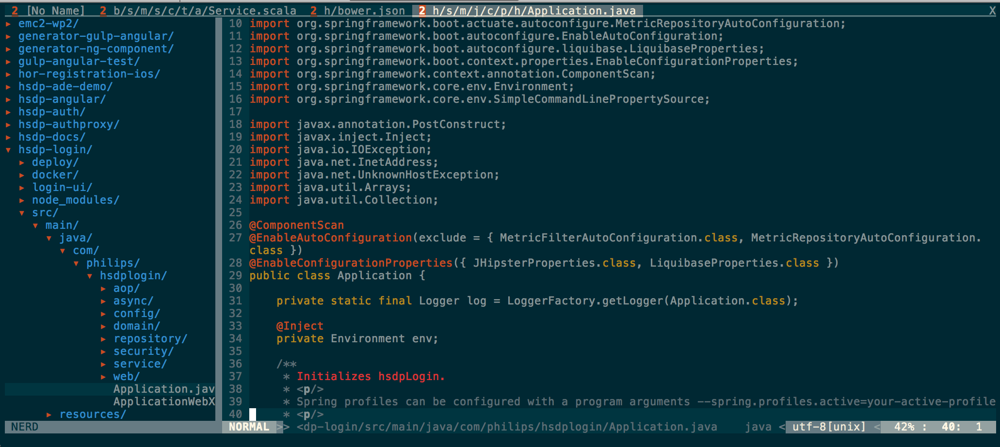

# vim
Repo intended to quickly setup VIM on any remote machine

## Install procedure
```bash
cd ~
git init .
git remote add -t \* -f origin https://github.com/bastijnv/vim.git
git checkout master

vim +PluginInstall +qall
```

## Result

